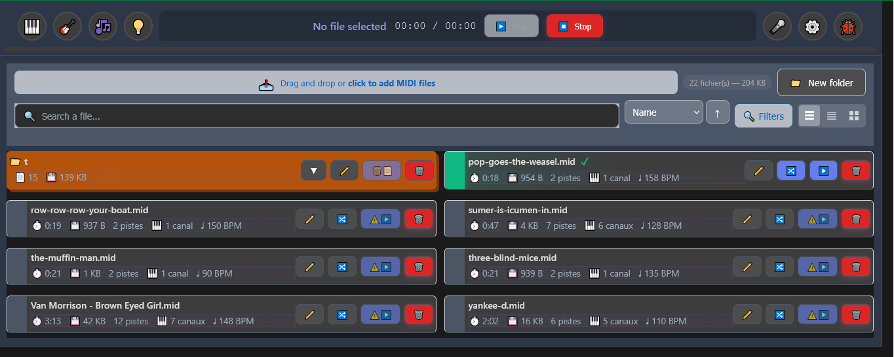
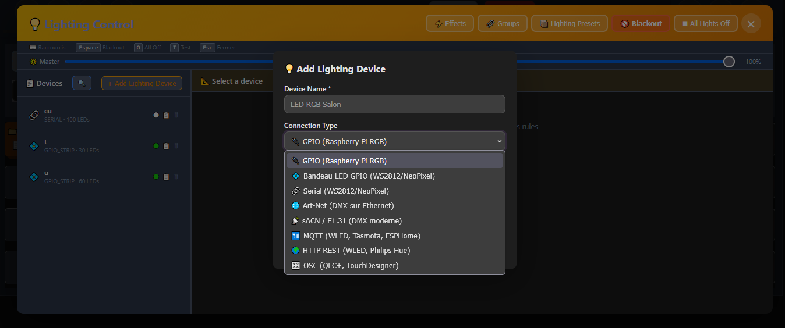
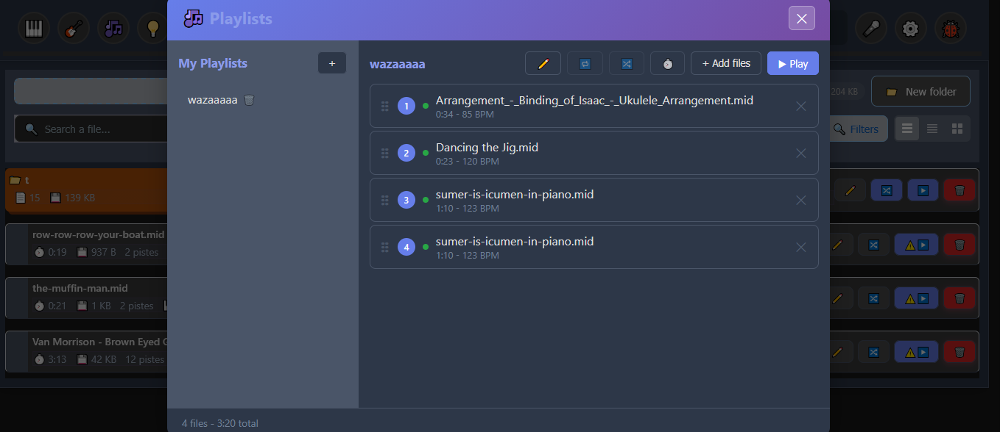
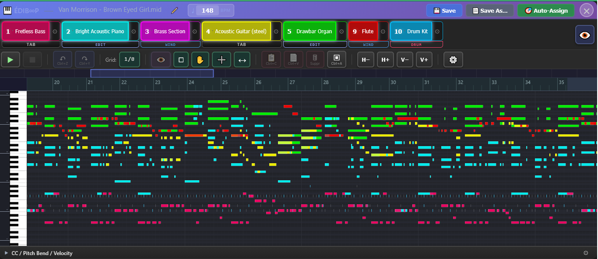
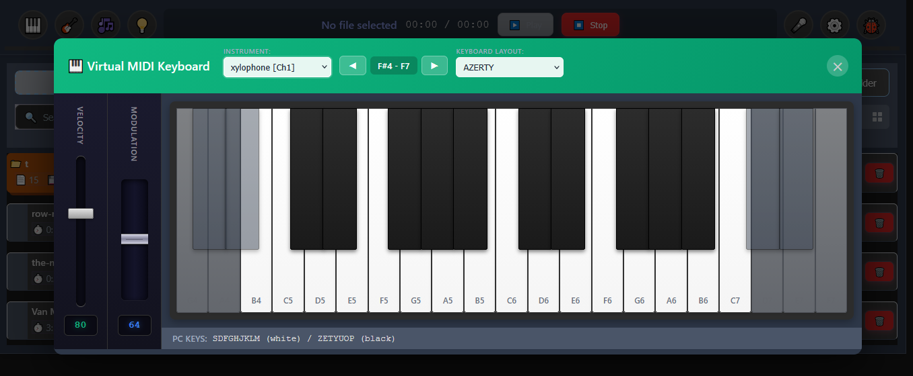
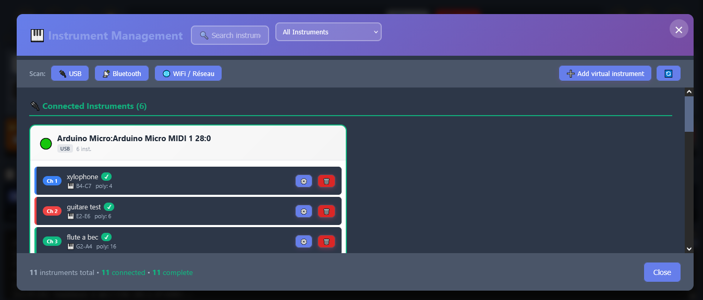
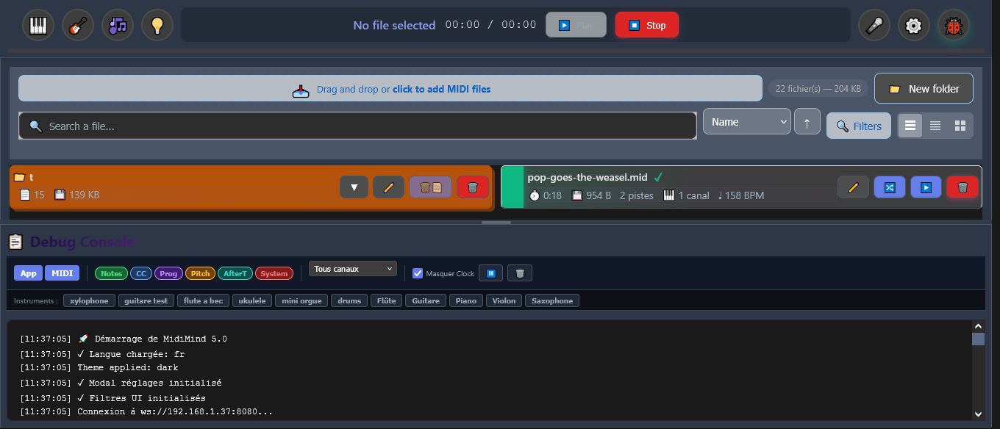

# Général Midi Boop


> [!WARNING]
> I'm starting to be happy with this interface, but there are still a few minor bugs to fix.

 
 **MIDI Orchestration System for Raspberry Pi with Modern Web Interface**

[](https://nodejs.org/)
[](LICENSE)
[](https://www.raspberrypi.org/)

Général Midi Boop is a MIDI management system that allows you to manage your MIDI devices, edit and play MIDI files with latency compensation, all from a modern web interface. It can automatically adapt MIDI files to the capabilities of your connected instruments.



## Installation

```bash
git clone https://github.com/glloq/General-Midi-Boop.git
cd General-Midi-Boop
chmod +x scripts/Install.sh
./scripts/Install.sh
```

Access the interface: `http://<Raspberry-Pi-IP>:8080`

See [docs/INSTALLATION.md](./docs/INSTALLATION.md) for detailed configuration.

## Features

### MIDI Devices

Support for multiple connection types:
- **USB MIDI** - Automatic detection and hot-plug
- **Bluetooth LE MIDI** - Scan and pair wireless instruments
- **Network MIDI (RTP-MIDI)** - Connect over WiFi/Ethernet
- **Serial MIDI (GPIO UART)** - Connect instruments via Raspberry Pi GPIO pins at 31250 baud. Supports multiple hardware UARTs (up to 6 on Pi 4 with device tree overlays), hot-plug monitoring, and full MIDI protocol including Running Status and SysEx. See [docs/GPIO_MIDI_WIRING.md](./docs/GPIO_MIDI_WIRING.md) for wiring details.

Configure each device with custom name, latency compensation, instrument type, note range, and polyphony.

### Lighting Control



Multiple driver support for stage and ambient lighting synchronized with MIDI playback:
- **GPIO LED Strips** - Direct control of LED strips via Raspberry Pi GPIO
- **ArtNet DMX** - Industry-standard DMX over Ethernet
- **sACN/E1.31** - Streaming ACN protocol for DMX
- **OSC** - Open Sound Control integration
- **HTTP** - HTTP-based lighting APIs
- **MQTT** - IoT messaging protocol for smart lighting

Includes a lighting effects engine, DMX fixture profiles, and full synchronization with MIDI playback.

### Auto-Adaptation of MIDI Files


Général Midi Boop can automatically analyze a MIDI file and assign each channel to the best-suited connected instrument:
- **Channel analysis** - Detects instrument type (drums, melody, bass, harmony), note ranges, and polyphony per channel
- **Instrument matching** - Evaluates connected instruments capabilities and generates compatibility scores (0-100)
- **Intelligent drum mapping** - Remaps General MIDI drum notes (35-81) to available instrument notes with priority-based substitution (kick → snare → hi-hat → crash → toms)
- **Octave wrapping** - Option to extend note range by wrapping notes into available octaves
- **Audio preview** - Listen to assignments before committing

### MIDI Files



- Upload and organize MIDI files in folders
- Drag-and-drop support
- Play, edit, or route files to devices
- **File management** - Rename, duplicate, move between folders, export/save as
- **Multi-select & batch operations** - Select multiple files for batch actions
- **Search & filtering** - Search by name, filter by duration, tempo, track count, instrument type, channel count, compatibility, and more
- **Filter presets** - Save and load custom filter combinations
- **Sorting** - Sort files by any criteria with ascending/descending order

### MIDI Editor



Built-in multi-mode editor with four specialized views sharing a common transport,
channel panel, and backend persistence.

**Four editing modes:**

| Mode | Purpose |
|------|---------|
| Piano Roll | Add / move / resize / re-channel / velocity, 16 coloured channels, snap grid (1/1 → 1/16) |
| Tablature | String instruments (guitar, bass, violin…) with bidirectional MIDI ↔ tab conversion |
| Drums | Grid-based drum pattern editor (GM drum map) |
| Wind | Articulation and breath dynamics for wind instruments |

**Toolbar actions:** save, save-as, rename, undo / redo, copy / paste / delete,
select-all, snap grid, horizontal & vertical zoom, play / pause / stop, auto-assign
routing, channel settings popover, preview source toggle (GM / routed).

**CC & automation editing:** CC 1 / 2 / 5 / 7 / 10 / 11 / 74 / 76 / 77 / 78 / 91 /
93, pitch bend, channel & poly aftertouch, velocity curves, and tempo automation,
with linear / exponential / logarithmic / sine curve drawing tools.

**Keyboard shortcuts:**

| Key | Action |
|-----|--------|
| `Ctrl/Cmd + S` | Save |
| `Ctrl/Cmd + Z` | Undo |
| `Ctrl/Cmd + Y` / `Ctrl+Shift+Z` | Redo |
| `Ctrl/Cmd + C` / `V` | Copy / paste selected notes |
| `Ctrl/Cmd + A` | Select all |
| `Delete` / `Backspace` | Delete selected notes (or CC / velocity points if that section is open) |
| `Space` | Play / pause |
| `Escape` | Close dialog or editor |

**Common features across modes:** built-in synthesizer preview (7 soundfonts),
per-channel routing to connected devices, playable-note highlighting, cursor
repositioning during playback pause, touch mode (separate Move / Add / Resize
buttons) for tablets.

**User preferences** (persisted in `localStorage` under `gmboop_settings`): touch
mode, keyboard-playback feedback, drag-playback feedback.

See [docs/MIDI_EDITOR.md](./docs/MIDI_EDITOR.md) for architecture, the public API,
and extension points.

### String Instruments & Tablature


Control real acoustic string instruments via solenoids/servos through MIDI CC. Includes a tablature editor with bidirectional MIDI-Tab conversion. Supports guitar, bass, violin, ukulele, and more with 19 tuning presets.

### Drum Pattern Editor

Visual drum grid editor for creating and editing drum patterns. Provides an intuitive grid-based interface for programming drum tracks with General MIDI drum mapping support.

### Wind Instrument Editor


Specialized editor for wind instrument articulations, allowing precise control over breath dynamics, tonguing, and expression parameters.

### Virtual Keyboard



Test devices from your browser:
- Mouse click and drag
- Computer keyboard support (AZERTY/QWERTY)
- Adjustable octave and velocity

### Channel Routing

Route each MIDI channel (1-16) to a different device for multi-instrument playback, with instrument type display.

### Microphone-Based Delay Calibration

Automatically measure the real latency of your instruments using a microphone:
- Sends MIDI notes and detects the audio response via ALSA
- Multiple measurements for statistical accuracy (median-based)
- Confidence scoring based on measurement consistency
- Configurable threshold and measurement count

### Instrument Management



Dedicated instrument management page:
- Define instrument capabilities (note range, polyphony, instrument type)
- Validation system to ensure all instruments are properly configured
- Enable/disable devices

### Settings

- Theme: Light, Dark, Colored
- Virtual keyboard octaves (1-4)
- Language selection

## Languages

Available in 28 languages: English, French, Spanish, German, Italian, Portuguese, Dutch, Polish, Russian, Chinese, Japanese, Korean, Turkish, Hindi, Bengali, Thai, Vietnamese, Czech, Danish, Finnish, Greek, Hungarian, Indonesian, Norwegian, Swedish, Ukrainian, Esperanto, Tagalog.

MIDI instrument names are translated in all supported languages.

## Development

### Prerequisites

- Node.js >= 20.0.0

### Setup

```bash
git clone https://github.com/glloq/General-Midi-Boop.git
cd General-Midi-Boop
npm install
```

### Commands



- `npm run dev` - Development server with hot reload
- `npm start` - Production server
- `npm test` - Run backend tests (Jest)
- `npm run test:frontend` - Run frontend tests (Vitest)
- `npm run lint` - ESLint check
- `npm run format` - Prettier formatting
- `npm run build` - Vite production build

### Docker

```bash
docker-compose up -d
```

## Deployment

Three deployment options are available:

- **Direct Node.js** - Run directly with `npm start` for simple setups
- **PM2** - Process manager for production with auto-restart and monitoring
- **Docker** - Containerized deployment with `docker-compose up -d`

See [docs/INSTALLATION.md](./docs/INSTALLATION.md) for detailed instructions on each option.

## Documentation

- [Installation Guide](./docs/INSTALLATION.md)
- [Architecture](./docs/ARCHITECTURE.md)
- [API Reference](./docs/API.md)
- [Auto-Assignment System](./docs/AUTO_ASSIGNMENT.md)
- [GPIO MIDI Wiring](./docs/GPIO_MIDI_WIRING.md)
- [SysEx Identity Protocol](./docs/SYSEX_IDENTITY.md)
- [Contributing](./CONTRIBUTING.md)
- [Changelog](./CHANGELOG.md)

## License

MIT License - see [LICENSE](LICENSE)
